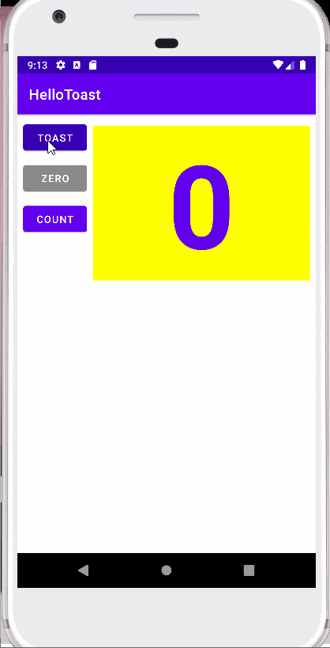
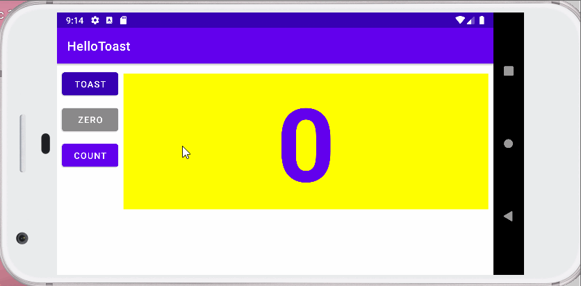
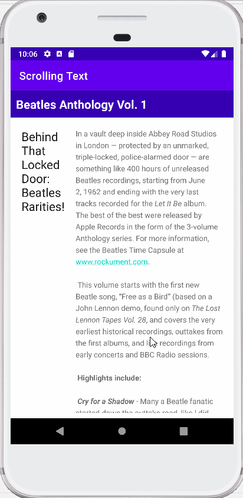
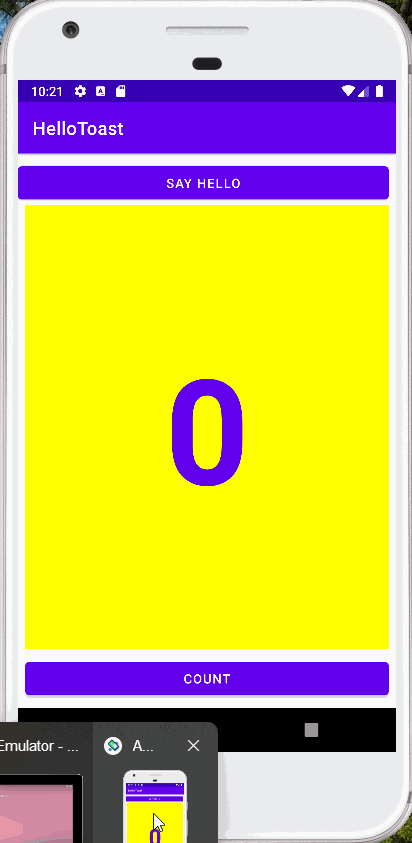

# Component - 1 Lab Exercise

## Android Fundamentals 1.2 Part A
As per the tutorials in 
[Android fundamentals 01.2 Part A: Your first interactive UI](https://developer.android.com/codelabs/android-training-layout-editor-part-a#1)
, task 1, 2, 3, 4 and 5 of this exercise was completed.

This is the screenshot of the app after successful running of the application.

### Coding Challenge

As per Codding Challenge given in the tutorials in 
[Android fundamentals 01.2 Part A: Your first interactive UI](https://developer.android.com/codelabs/android-training-layout-editor-part-a#1)

This is the screenshot of the app after successful running of the application.

## Android Fundamentals 1.2 Part B
After completing Part-A, as per the tutorials in
[Android fundamentals 01.2 Part B: Your first interactive UI](https://developer.android.com/codelabs/android-training-layout-editor-part-b#0)
, task 1, 2, and 3 from this part was completed.

The screenshot after completing the all of task is presented below.

### Coding Challenge 1
The coding challenge has been completed as mentioned in the 
[Android Fundamentals 1.2 Part B Coding Challenge 1](https://developer.android.com/codelabs/android-training-layout-editor-part-b#3).

The screenshot after successful running of the app is presented below:

### Part B Homework

The homework is completed according to the
[Android Fundamentals 1.2 Part B Homework](https://developer.android.com/codelabs/android-training-layout-editor-part-b#9).

The screenshots after successful running of the app are presented below:

* Vertical
 

* Landscape

## Android fundamentals 01.3:Text and scrolling views
As per the tutorials in 
[Android fundamentals 01.3:Text and scrolling views](https://developer.android.com/codelabs/android-training-text-and-scrolling-views#1)
, task 1, 2, 3, 4 and 5 of this exercise was completed.

This is the screenshot of the app after successful running of the application.

### Coding Challenge
The coding challenge has been completed as mentioned in the 
[Android Fundamentals 1.3 Coding Challenge](https://developer.android.com/codelabs/android-training-text-and-scrolling-views#6).

The screenshot after successful running of the app is presented below:

### Part 1.3 Homework

The homework is completed according to the
[Android fundamentals 01.3:Text and scrolling views Homework](https://developer.android.com/codelabs/android-training-text-and-scrolling-views#10).

The screenshots after successful running of the app are presented below:
 

## Android fundamentals 02.1:Activities and intents

As per the tutorials in 
[Android fundamentals 02.1:Activities and intents](https://developer.android.com/codelabs/android-training-create-an-activity#1)
, task 1, 2, 3, and 4 of this exercise was completed.

This is the screenshot of the app after successful running of the application.

### Part 2.1 Homework

The homework is completed according to the
[Android fundamentals 02.1:Activities and intents Homework](https://developer.android.com/codelabs/android-training-create-an-activity#11).

The screenshots after successful running of the app are presented below:
 

## Android fundamentals 02.2:Activity lifecycle and state

As per the tutorials in 
[Android fundamentals 02.2:Activity lifecycle and state](https://developer.android.com/codelabs/android-training-activity-lifecycle-and-state#1)
, task 1 and 2 of this exercise was completed.

This is the screenshot of the app after successful running of the application.

### Part 2.1 Homework

The homework is completed according to the
[Android fundamentals 02.2:Activity lifecycle and state Homework](https://developer.android.com/codelabs/android-training-activity-lifecycle-and-state#8).

The screenshots after successful running of the app are presented below:
 

